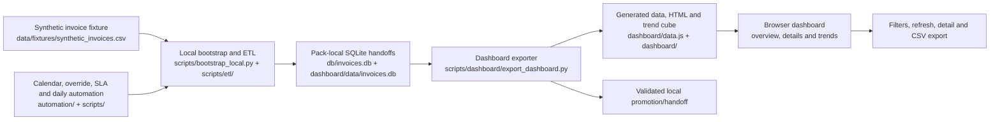
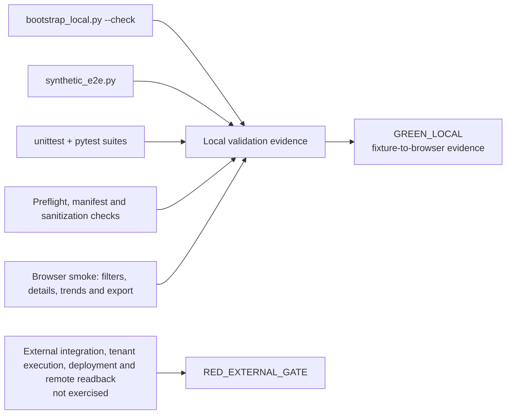

# Architecture and validation map

This document gives a visual map of the public Invoice Process Dashboard pack. It is documentation only: the invoice ETL, SQLite handoff, dashboard, calendar/override/SLA flows and tests are unchanged.

For the cross-repository view, see the [portfolio architecture map](https://github.com/brunotaisa01-source/escalation-app-portfolio/blob/main/docs/PORTFOLIO_MAP.md).

## Runtime flow

The default path is local and uses the two-row synthetic fixture. Deployment is an explicit opt-in path with staging and validation; the pack does not perform a remote mutation by default.

## Test and status flow

`GREEN_LOCAL` is limited to the fixture, local database, generated browser assets and documented smoke checks. `RED_EXTERNAL_GATE` remains for remote credentials, permissions, live refresh, production scheduling, deployment and readback.

## Main entrypoints

- `python -B -m scripts.bootstrap_local --check` runs the local preflight.
- `python scripts\synthetic_e2e.py` runs the synthetic end-to-end path.
- `python -B -m unittest discover -s tests -v` and `python -B -m pytest -q -p no:cacheprovider` run the suites.
- `cmd /d /c automation\RUN_PREFLIGHT.bat` and `RUN_DAILY.bat` exercise the bounded automation paths.
- `manifest.json` and `runtime/manifests/e2e_latest.json` record local evidence.
